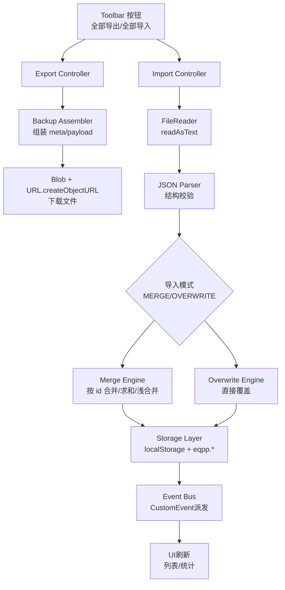

# 全量导出/导入（含合并导入）设计文档

## 概览（Overview）
为错题练习平台（EQPP）提供完整的数据备份与恢复能力，并支持“合并导入（MERGE）”以融合不同来源的数据，确保数据一致性、鲁棒性与可用性。导出使用 Blob 下载 JSON；导入使用 FileReader 解析 JSON；合并按 id 规则处理数组，索引与统计采用求和/取最新策略；设置与模板浅合并。设计围绕现有存储与事件体系实现，并兼容覆盖式（Overwrite）导入。

参考资料（关键实现点）：
- FileReader 用于文件读取（中文 MDN）：https://developer.mozilla.org/zh-CN/docs/Web/API/FileReader
- Blob 对象与 URL.createObjectURL 用于下载生成（中文 MDN 相关页示例）：https://developer.mozilla.org/zh-CN/docs/Web/API/File_API/Using_files_from_web_applications
- Web Storage（localStorage）接口说明（中文 MDN）：https://developer.mozilla.org/zh-CN/docs/web/API/Storage

## 架构（Architecture）

## 组件与接口（Components and Interfaces）
- Export Controller
  - 入口：`#full-export` 按钮点击事件
  - 职责：收集所有键，组装 `meta` 与 `payload`，生成 Blob 下载。
  - 接口：`collectPracticeFilters()`、`getJSON(key)`、`downloadBlob(blob, filename)`、`nowStamp()`。

- Import Controller
  - 入口：`#full-import-file` 变更事件（选择文件后）
  - 职责：读取备份文件、解析 JSON、模式选择、调用相应引擎（合并/覆盖）、落库、派发事件、刷新 UI。
  - 接口：`FileReader.readAsText(file)`、`JSON.parse(text)`、`setJSON(key, value)`、`dispatchUpdateEvents()`、`refreshAfterDataChange()`。

- Merge Engine（合并引擎）
  - 入口：解析成功且选择 MERGE
  - 职责：
    - `questions`/`errorQuestions`：按 `id` 合并（后者覆盖同名字段；缺失 `id` 生成），并重建 `eqpp.questions`/`eqpp.errorQuestions`。
    - `studyData`：计数求和、`studyDays` 取最大、其余备份覆盖。
    - `eqpp.studyIndex`：同题目 `id` 的 `answeredCount` 求和；`lastAnsweredTime` 取最新。
    - `practiceSettings`/`dailyPracticeSettings`：浅合并（备份覆盖同名键）。
    - `eqpp.batches`：数组去重合并（优先按 `id`，否则按 JSON 序列化内容）。
    - `eqpp.mappingTemplates`：浅合并（备份覆盖）。
    - `practiceFilter:*`：备份覆盖同名键。
  - 接口：`mergeArrayById(cur, inc)`、`rebuildEqppQuestions(questions)`、`mergeStudyData(cur, inc)`、`mergeStudyIndex(cur, inc)`、`mergeShallow(cur, inc)`、`mergeArraySimple(cur, inc)`。

- Overwrite Engine（覆盖引擎）
  - 入口：解析成功且选择 OVERWRITE
  - 职责：将 `payload` 中的键直接写入存储层，并写入所有 `practiceFilter:*` 快照。

- Storage Layer（存储层）
  - localStorage 键集合：`questions`、`errorQuestions`、`studyData`、`eqpp.questions`、`eqpp.errorQuestions`、`eqpp.studyIndex`、`practiceSettings`、`dailyPracticeSettings`、`eqpp.batches`、`eqpp.mappingTemplates`、`practiceFilter:*`。
  - 辅助：统一的 `getJSON`/`setJSON` 包装处理类型与默认值。

- Event Bus（事件总线）
  - 自定义事件：`legacy:questions:updated`、`legacy:errorQuestions:updated`、`eqpp:questions:updated`、`eqpp:errorQuestions:updated`、`legacy:studyData:updated`。

## 数据模型（Data Models）
- Backup JSON
  - `meta`: `{ app: 'EQPP', feature: 'full-backup', timestamp: ISOString, version?: string, note?: string }`
  - `payload`: `{ questions: Question[], errorQuestions: ErrorQuestion[], studyData: StudyData, eqpp_questions: EqppQuestion[], eqpp_errorQuestions: EqppErrorQuestion[], eqpp_studyIndex: Record<string, StudyIndexItem>, practiceSettings: object, dailyPracticeSettings: object, eqpp_batches: any[], eqpp_mappingTemplates: Record<string, any>, practiceFilters: Record<string, any> }`

- Question
  - 字段：`id`（string，唯一）、`question/content`（string）、`answer/correctAnswer`（string）、`type`、`difficulty`、`score`、`knowledge`、`analysis`、`note/correctMethod/errorReason`、`tags`（string 或 string[]）、`source`、`date/createdAt/lastErrorTime`。

- EqppQuestion（标准映射）
  - 字段：`id`、`question`、`answer`、`type`、`difficulty?`、`score?`、`knowledge?`、`analysis?`、`note?`、`tags`（英文逗号分隔）、`source?`、`createdAt`（ISO 或 `YYYY-MM-DDT00:00:00`）。

- StudyData
  - 字段：`totalStudyTime`、`totalAnswered`、`totalErrors`、`studyDays`、其他扩展字段。

- StudyIndexItem（eqpp.studyIndex）
  - 字段：`answeredCount`（累加）、`lastAnsweredTime`（取最新）。

## 错误处理（Error Handling）
- 解析失败：显示 `Import failed.`，不写入存储。
- 结构无效（缺失 `payload`）：显示 `Invalid backup file.`，不写入存储。
- 类型不符：跳过或使用默认值继续处理；记录控制台错误信息。
- 大文件/性能压力：可提示 `Backup too large.` 并中止操作；建议分批次数据导入（未来扩展）。
- FileReader 失败：显示 `Failed to read file.`。

## 测试策略（Testing Strategy）
- 单元测试（`src/test/java/*Test.java`）
  - `FullBackupTest`：
    - 导出结构校验（`meta` 与完整 `payload` 键）。
    - 覆盖导入成功路径（事件派发与 UI 刷新可在集成环境验证）。
    - 合并导入示意性断言（按 id 合并不减少数量、学习计数求和、设置浅合并保留与新增键）。
- 集成测试（可选）：
  - 浏览器驱动（Selenium/WebDriver）：选择文件触发、拦截下载 URL、验证事件与 UI 刷新。

## 关键设计决策与理由（Decisions & Rationales）
- 使用 Blob + URL.createObjectURL 进行下载：无需服务端，符合前端备份场景，性能良好。（参考：MDN File API 使用方式）
- 合并规则以 `id` 为核心：避免内容模糊匹配复杂度与风险，保持确定性；缺失 `id` 时生成唯一 `id`。
- 学习数据与索引的合并采用“求和/取最新”：符合数据累积的语义（累计答题次数与时序最新）。
- 设置与模板浅合并：避免过度复杂，保留本地项同时允许备份覆盖同名键。

## 风险与缓解（Risks & Mitigations）
- 备份结构多样性导致合并复杂：通过标准化映射 `rebuildEqppQuestions` 降低异构字段影响。
- 大体量数据性能与内存：使用迭代合并与 Map 索引，避免嵌套深度合并；必要时提示并中止。
- 错误数据污染：解析失败直接中止；类型不符采用默认值并局部跳过；控制台打印错误便于调试。

