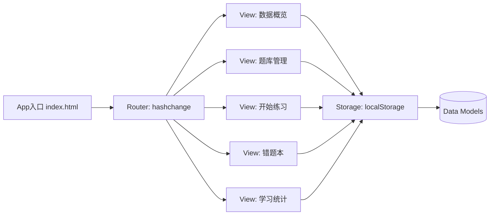

# 拆分页面设计文档（数据概览 / 题库管理 / 开始练习 / 错题本 / 学习统计）

## Overview
本设计基于已确认的拆分页面需求，采用 **单文件 + Hash 路由** 的轻量方案，将现有页面拆分为五个视图：`数据概览`、`题库管理`、`开始练习`、`错题本`、`学习统计`。以 **共享本地存储数据源**（localStorage，后续可渐进迁移 IndexedDB）为核心，确保页面切换不丢失状态与数据。

- 导航：顶部固定导航栏（5 个入口），随路由高亮当前页面。
- 路由：`window.location.hash` + `hashchange` 事件驱动，刷新保留所在页面与状态（通过 URL 片段与本地存储协作）。
- 数据：统一存储键白名单保留（questions、errorQuestions、studyData、practiceSettings、dailyPracticeSettings 等）。
- 视图：五个页面视图模块独立渲染与事件绑定，使用渐进增强，避免初次渲染空引用问题。
- 兼容性：避免使用不必要的 ES6+ 特性，关键事件绑定延迟至 DOMContentLoaded 后执行。

参考资料：
- MDN HashChangeEvent（路由事件）: https://developer.mozilla.org/zh-CN/docs/Web/API/HashChangeEvent
- MDN 散列路由术语: https://developer.mozilla.org/zh-CN/docs/Glossary/Hash_routing
- localStorage 基本用法（参考文档示例）: 掘金综述 https://juejin.cn/post/7438529282812018700
- IndexedDB 与本地存储对比（理解迁移方向）: 掘金综述 https://juejin.cn/post/7548795876208050203
- 图表库选择参考（轻量 vs 丰富）: ECharts 概览 https://echarts.apache.org/ ; Chart.js 文档 https://www.chartjs.org/docs/latest/

## Architecture
采用“**路由 -> 控制器 -> 视图 -> 存储**”的简单架构。



- App 入口：单 HTML（现有 `src/rror_question_practice_platform.html`），后续可拆分 JS 模块存放于 `src/assets/js`。
- Router：监听 `hashchange` + 首次加载解析 `location.hash`，驱动视图切换。
- Views：五个视图模块负责渲染、事件绑定、与存储交互。
- Storage：统一存取工具封装白名单保留策略，提供安全清理接口。
- Data Models：以 JSDoc 定义对象结构，便于维护与校验。

## Components and Interfaces

- 顶部导航（Navbar）
  - 职责：渲染五个入口；根据当前路由高亮；触发路由切换。
  - 接口：`renderNavbar(activeRoute)`；事件：`click` -> 更新 `location.hash`。

- 路由器（Router）
  - 职责：解析 hash（如 `#overview`/`#manage`/`#practice`/`#errors`/`#stats`），切换视图。
  - 接口：`initRouter()`；`navigateTo(route)`；事件：`window.onhashchange`。

- 视图模块（Views）
  - `OverviewView`（数据概览）
    - 显示题库摘要与趋势；无数据显示空态与引导。
    - 接口：`mount(container)`、`unmount()`、`render(dataSummary)`。
  - `ManageView`（题库管理）
    - 表格展示、筛选、双击编辑模态；批量编辑、导入/导出。
    - 接口：`mount(container)`、`applyFilter(criteria)`、`editCell(row, col)`、`bulkUpdate(items, payload)`、`import(data)`、`export(type)`。
  - `PracticeView`（开始练习）
    - 读取 `practiceSettings`/`practiceFilter:*`，提供练习队列与实时反馈。
    - 接口：`startSession(config)`、`submitAnswer(answer)`、`next()`、`finish()`。
  - `ErrorsView`（错题本）
    - 展示错题、复习模式、纠正并可移出错题本。
    - 接口：`load()`、`review(mode)`、`correct(item)`、`remove(item)`。
  - `StatsView`（学习统计）
    - 从 `studyData` 聚合并渲染图表；交互筛选更新。
    - 接口：`aggregate(params)`、`renderCharts(chartsConfig)`。

- 存储工具（Storage）
  - 键白名单：`questions`、`errorQuestions`、`studyData`、`practiceSettings`、`dailyPracticeSettings`、`eqpp.questions`、`eqpp.errorQuestions`。
  - 可清理键：`practiceFilter:*`、`__AUTO_RESUME__`、`eqpp.batches`、`eqpp.mappingTemplates`。
  - 接口示例：
    - `get(key, defaultValue)`：安全读取（JSON 解析失败时返回默认值）。
    - `set(key, value)`：安全写入（字符串化）。
    - `remove(key)`、`clearCachePreserveData()`：缓存清除但保留答题数据。
    - `migrate()`：可选，将旧键映射到新结构。

- 事件与消息
  - `hashchange`：路由切换。
  - 自定义事件：`storage:updated`（某数据更新后通知其他视图刷新）。

## Data Models
使用 JSDoc 描述核心数据结构，便于开发时校验与 IDE 提示。

```js
/**
 * @typedef {Object} Question
 * @property {string} id
 * @property {string} title
 * @property {string} source
 * @property {string} difficulty
 * @property {string} errorReason
 * @property {string} correctMethod
 * @property {string[]} tags
 */

/**
 * @typedef {Object} PracticeSettings
 * @property {number} batchSize
 * @property {string[]} includeTags
 * @property {string[]} excludeTags
 * @property {boolean} preferErrors
 * @property {string} mode  // e.g., "daily", "review"
 */

/**
 * @typedef {Object} StudyRecord
 * @property {string} questionId
 * @property {boolean} correct
 * @property {number} timestamp
 */

/**
 * @typedef {Object} StatsAggregation
 * @property {number} totalQuestions
 * @property {number} totalErrors
 * @property {number} practicedToday
 * @property {Array<{date:string, count:number}>} trend7d
 * @property {Array<{date:string, count:number}>} trend30d
 */
```

## Error Handling
- 存储读写异常：显示英文错误提示（如 `Failed to read local data. Please retry.`），提供重试与备选（导出数据）。
- 导入格式错误：拒绝并显示英文提示（如 `Invalid import file.`），不影响现有题库。
- 路由未知：显示 404 英文文案（如 `Page not found.`），提供返回数据概览入口。
- 视图初始化空引用：所有视图在 `DOMContentLoaded` 后初始化，必要处做元素存在性检查。

## Testing Strategy
- 总体策略：以 Java 测试类驱动端到端与关键交互验证（Selenium WebDriver + JUnit）。
- 目录与规范：
  - 位置：`src/test/java`
  - 类名以 `Test` 结尾，方法使用 `@Test` 注解。
- 关键用例：
  - `NavigationTest`：验证导航 5 页切换、高亮正确、刷新后保持页面。
  - `ManageViewTest`：双击编辑弹窗、保存回写、批量编辑与导入/导出流程。
  - `PracticeFlowTest`：读取设置生成队列、提交答案反馈、结束练习写入 `studyData`。
  - `ErrorsViewTest`：错题加载、复习模式、纠正后移出逻辑。
  - `StatsViewTest`：统计聚合、维度筛选更新与图表渲染存在性。
  - `StoragePreserveTest`：清除缓存后保留答题数据键验证。

## Implementation Notes
- 初始路由方案：`#overview | #manage | #practice | #errors | #stats`，默认 `#overview`。
- 响应式：表格列采用不同 `max-width` 与断点调整，移动端适当放宽或折行。
- 图表库：优先选用 **Chart.js**（轻量、快速集成）；如需复杂交互与大数据量再切换 **ECharts**（更丰富）。
- 性能：大于 10k 条时采用分页/虚拟列表、摘要聚合（避免卡顿）。
- 兼容性：避免 `includes` 等特性，统一以 `indexOf` 判断；事件绑定均做元素存在性检查。

## Research Summary
- Hash 路由：通过 `hashchange` 与片段标识符管理 SPA 导航，无需整页刷新（MDN 术语与事件资料）。
- localStorage：键值存储简便，但需注意 JSON 解析与容量、同步 API 可能阻塞；对大数据更适合 IndexedDB。
- IndexedDB：结构化大数据更合适，未来可作为迁移方向（先保留当前 localStorage 方案）。
- 图表库：Chart.js 轻量适合快速集成；ECharts 种类更丰富，适合复杂统计。
